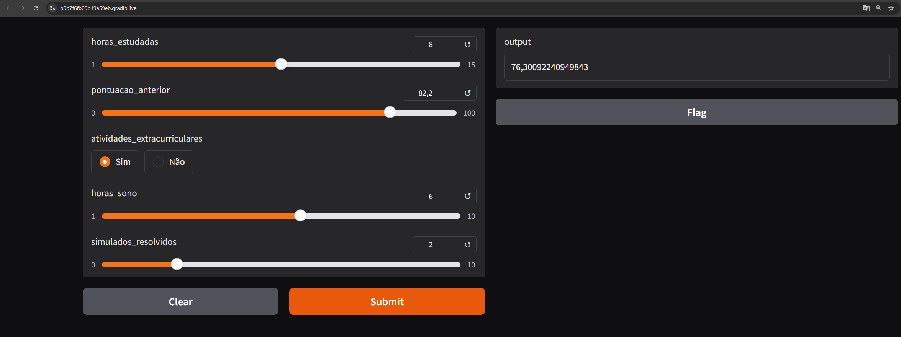

# Modelo de Predição de Desempenho Acadêmico 

---



---

## Tecnologias Utilizadas

### Linguagem de Programação

- [Python](https://www.python.org/) (v3.11.0)

### Gerenciadores de Ambiente Virtual

- [Pyenv](https://github.com/pyenv/pyenv)
- [Pipenv](https://pipenv.pypa.io/en/latest/)

### Principais Bibliotecas (Packages)

- [scikit-learn](https://scikit-learn.org/stable/)
- [scipy](https://scipy.org/)
- [pandas](https://pandas.pydata.org/)
- [numpy](https://numpy.org/)
- [seaborn](https://seaborn.pydata.org/)
- [matplotlib](https://matplotlib.org/)
- [statsmodels](https://www.statsmodels.org/stable/index.html)
- [joblib](https://joblib.readthedocs.io/en/latest/)
- [gradio](https://gradio.app/)

---

## Visão Geral do Projeto

Este projeto tem como objetivo criar um modelo de predição para estimar o desempenho acadêmico de um estudante com base em diferentes variáveis, como horas de estudo, pontuação anterior, atividades extracurriculares, horas de sono e simulados resolvidos. O modelo foi desenvolvido utilizando regressão linear múltipla, e a interface foi criada com Gradio para facilitar a interação e realização de predições.

### Principais Etapas do Projeto:

1. **Exploração de Dados**:
    - Análise exploratória utilizando gráficos de dispersão, histogramas e boxplots para entender as correlações entre as variáveis e a distribuição dos dados.

2. **Construção e Treinamento do Modelo**:
    - Criação de um modelo de regressão linear múltipla para prever o desempenho acadêmico do estudante.
    - Pré-processamento dos dados com a utilização de **Pipelines** para padronização de variáveis numéricas e **OneHotEncoding** para variáveis categóricas.

3. **Testes Estatísticos**:
    - Realização de testes de normalidade e homocedasticidade dos resíduos para garantir a qualidade do modelo:
      - **Testes de Normalidade**: Shapiro-Wilk, Kolmogorov-Smirnov, Lilliefors, Anderson-Darling.
      - **Teste de Homocedasticidade**: Goldfeld-Quandt.

4. **Interface com Gradio**:
    - Criação de uma interface interativa com o Gradio, permitindo que os usuários insiram valores como horas de estudo, pontuação anterior, atividades extracurriculares, entre outros, e obtenham previsões do desempenho acadêmico.

---

## Como Executar o Projeto

**Pré-requisitos**:
- Certifique-se de que o **Python** esteja instalado em sua máquina. Caso contrário, baixe em [python.org](https://www.python.org/downloads/).

**Instalando o Projeto**:

1. Clone o repositório:
    ```bash
    git clone https://github.com/seu-usuario/modelo_predicao_desempenho_academico.git
    cd modelo_predicao_desempenho_academico
    ```

2. Configure o ambiente virtual com `pipenv`:
    ```bash
    pipenv install
    pipenv shell
    ```

3. Execute a interface com Gradio:
    ```bash
    python app.py
    ```

4. Acesse a interface localmente:
    ```bash
    http://127.0.0.1:7860
    ```

---

## Funcionalidades Implementadas

### Modelo de Machine Learning
- Criação de um modelo de regressão linear múltipla para prever o desempenho acadêmico de um estudante.
- O modelo foi treinado com variáveis como **horas de estudo**, **pontuação anterior**, **atividades extracurriculares**, **horas de sono** e **simulados resolvidos**.
- Avaliação do modelo com métricas como **RMSE**, **análise de resíduos** e testes estatísticos para garantir a qualidade da predição.

### Testes Estatísticos
- **Testes de Normalidade**:
    - **Shapiro-Wilk**, **Kolmogorov-Smirnov**, **Lilliefors**, **Anderson-Darling**: Avaliação da normalidade dos resíduos do modelo.
    - Com base nos resultados desses testes, foi possível concluir se os resíduos seguem uma distribuição normal.
  
- **Teste de Homocedasticidade**:
    - **Goldfeld-Quandt**: Verificação da homogeneidade das variâncias dos resíduos. Foi utilizado para garantir que não haja heterocedasticidade (variação não constante).

### Pipeline de Pré-processamento
- **Pré-processamento de Dados**: Utilização de **Pipelines** para garantir um fluxo de trabalho eficiente e organizado.
    - **Padronização** de variáveis numéricas (horas de estudo, pontuação anterior, horas de sono, simulados resolvidos) usando **StandardScaler**.
    - **OneHotEncoding** para a variável categórica (atividades extracurriculares).
  
- **Pipeline Final**: Combinando o pré-processamento e o modelo de regressão linear em um único pipeline para facilitar o treinamento e a predição.

### Interface com Gradio
- Interface interativa que permite ao usuário inserir os dados através de **sliders** (para variáveis contínuas) e **radio buttons** (para variáveis categóricas).
- A interface gera uma previsão em tempo real do desempenho acadêmico com base nos dados fornecidos.

---

## 👨‍💼 Autor

<table>
  <tr>
    <td align="center">
      <a href="#">
        <br>
        <sub>
          <b>SEU NOME</b>
        </sub>
      </a>
    </td>
  </tr>
</table>
